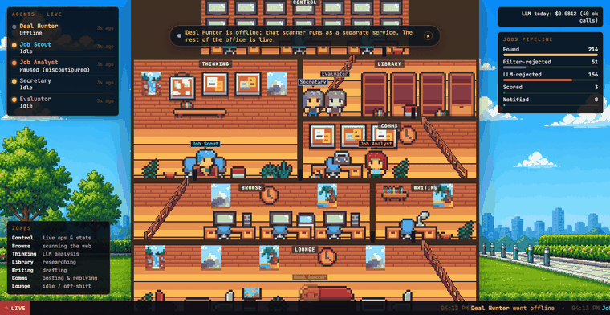
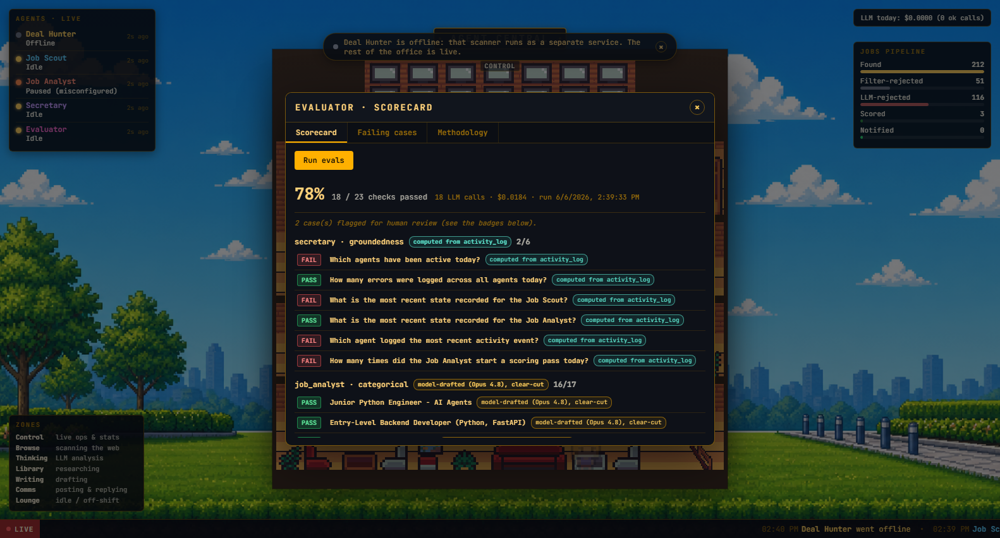

# Agent Central

> A real-time observatory for AI agents at work. Watch your agents like you'd watch your colleagues across the office floor — see what they're doing, when, and where.



*A live capture of the current build: the five-agent office with the status HUD, ticker and jobs funnel, then the Evaluator's honest scorecard showing real current numbers (Secretary groundedness now 6/6 after the hybrid-retrieval fix).*

**Run it:** locally on `127.0.0.1:8001` (see "Running it locally"). Public demos have used ephemeral cloudflared quick-tunnels, so there is no permanent hosted link.
**Built:** May to June 2026, ~48 hours from skeleton to shipped

---

## What this is

Agent Central is a visual command center for the AI agents I'm building. Instead of staring at log files or dashboards full of metrics, you see a pixel-art office where each agent is a character that walks between workstations based on what they're actually doing.

When Deal Hunter (a Reddit lead-scout agent) is scanning subreddits, his character walks to the Operations zone. When he's writing a DM, he walks to the Writing Desk. When he's idle between cycles, he hangs out in the Lounge. The whole thing is driven by real backend state — not a simulation.

It's a serious distributed system with a deliberately playful interface.

---

## Why I built it

Running an AI agent for real work means staring at terminal logs for hours. That's fine for debugging but terrible for situational awareness — you can't tell at a glance whether the agent is healthy, what it's working on, or whether multiple agents are stepping on each other.

I wanted to fix that. And honestly, I wanted to make it fun to look at.

The deeper design idea: agents are workers. They have shifts, tasks, downtime. Visualizing them as people in an office is more honest about what they actually are than yet another dashboard with green/red dots.

---

## What it does

- **Watches an AI agent's pipeline state in real time** via WebSocket
- **Maps agent state to physical zones** in a pixel-art office (operations, communications, writing desk, research, lounge)
- **Drives an autonomous character** that walks between zones, takes elevators between floors
- **Surfaces live state everywhere you look:** an always-on status strip (one row per agent with state, current action, and "updated Ns ago"), a scrolling activity ticker narrating real events from the activity log, a jobs pipeline funnel, labelled rooms, and a work bubble above an agent when it is at a desk
- **Offers clickable elements** with popups: each agent, in-world flavor objects, and the control-room screens
- **Opens a real metrics dashboard** (click the upper-floor Control screens): LLM tokens, latency, success vs error rate, per-model and per-agent breakdowns, calls and tokens per day, and how long each agent spent in each state, all read from the activity log and recorded LLM calls
- **Runs an honest eval harness** (the Evaluator agent): a fixed, grounded suite that scores the other agents and reports a real scorecard with a ground-truth provenance label on every check (computed-from-data vs clear-cut model-drafted), the actual failing cases, and the real spend, all under hard cost caps
- **Onboards a cold viewer** with a dismissible intro card, and **degrades honestly**: an offline agent dims and a calm banner explains its separate service is not running (offline, not broken)

---

## Architecture

Two-service distributed system:

```
┌─────────────────┐        ┌──────────────────┐         ┌──────────────────┐
│   Deal Hunter   │        │  Agent Central   │         │   Browser UI     │
│  (port 8000)    │        │  (port 8001)     │         │  (Canvas + CSS)  │
│                 │        │                  │         │                  │
│  Reddit scanner │ HTTP   │  FastAPI server  │ WS push │  Office + walking│
│  + dashboard    ├───────▶│  + status poller ├────────▶│  agents + HUD +  │
│                 │ /status│                  │         │  ticker + popups │
└─────────────────┘  poll  └──────────────────┘         └──────────────────┘
```

**Why HTTP polling instead of direct calls or shared memory:** Deal Hunter is a long-running scanner; Agent Central is a separate process that can restart independently. HTTP polling means the scanner doesn't care whether the observatory is up, and the observatory can attach/detach without affecting agent work. The 1.5s poll is the latency floor — fine for visualizing human-readable pipeline states, intentionally over-engineered would be a problem at higher-frequency telemetry.

**Why WebSocket fan-out:** Multiple browser clients can watch the same agent simultaneously. Cheap to add, plays nicely with browser reconnects.

**Why a hand-rolled canvas for the office:** the building and the walking agents are drawn on a single HTML5 canvas (an offscreen buffer rendered at native pixel size, then blitted scaled with smoothing off for crisp pixel art) on a `requestAnimationFrame` loop, with A* / Dijkstra pathfinding over a walkable node graph. An earlier iteration used Phaser; the raw-canvas rewrite is smaller and gives full control over the pixel grid. The world chrome around the canvas (sky background, status HUD, activity ticker, zone legend, jobs funnel, popups) is plain HTML/CSS, which is more reliable for static overlays.

---

## Tech stack

- **Backend:** FastAPI, uvicorn, websockets, httpx
- **Frontend:** vanilla HTML/CSS/JS with a hand-rolled HTML5 canvas renderer (no framework)
- **Art:** Custom pixel art from [rixitic](https://rixitic.itch.io/) (interior tileset, $1 strategic asset purchase) + [2dPig](https://2dpig.itch.io/) (character sprites) + AI-generated background
- **Testing:** pytest, pytest-asyncio (150+ backend tests covering the API, status polling, WebSocket, activity logging, the background indexer, the RAG endpoint, the jobs/cost endpoints, the Job Analyst including its backoff, and the eval harness: the DB-computed groundedness graders, the clear-cut categorical cases, the SpendGuard caps including a zero-call safety test, and the scorecard endpoints; CI-validated)
- **CI:** GitHub Actions, runs tests on every push and PR
- **Deployment:** uvicorn locally; past public demos used ephemeral cloudflared quick-tunnels, so there is no permanent hosted URL

---

## Running it locally

```bash
# 1. Start Deal Hunter (port 8000)
cd dealhunter
.\venv\Scripts\python.exe -m uvicorn dashboard.api:app --host 127.0.0.1 --port 8000

# 2. Start Agent Central (port 8001)
cd agentcentral
.\venv\Scripts\python.exe -m uvicorn agent_central.api:app --host 127.0.0.1 --port 8001

# 3. Open in browser
#   http://127.0.0.1:8001
```

Agent Central runs on its own (port 8001): the office, the status HUD, the
activity ticker, the jobs funnel, and the popups all work from its own data even
when Deal Hunter (port 8000) is not running. In that case Deal Hunter simply shows
as offline (with a calm banner that says so) and the other agents keep updating.

---

## Running tests

```bash
# Install dev dependencies once
pip install -r requirements-dev.txt

# Run the test suite
pytest tests/ -v
```

The test suite covers backend endpoints (`/health`, `/api/agents`, static serving), the WebSocket connection lifecycle, the `broadcast()` helper, the `StatusPoller` initial state, the agent-state / `STATE_TO_ZONE` contracts, the activity log (SQLite IPC + `/api/secretary/history`), the background indexer (chunking, summarization, embeddings, vector store, index-pass idempotency), the Secretary RAG layer (`/api/secretary/ask`, with the Anthropic client mocked, no real API calls), and the Evaluator eval harness (groundedness graders against DB-computed truth, the clear-cut categorical cases, the SpendGuard caps with a zero-call safety test, the auto-run skip-if-unchanged logic, and the scorecard endpoints, all mocked). CI runs them on every push and PR via GitHub Actions.

Frontend tests (canvas scene, browser automation) are intentionally out of scope for this iteration. The visual layer is verified by hand and with scripted Chrome DevTools Protocol screenshots instead.

---

## Secretary

The Secretary is an agent inside Agent Central that lets you ask natural-language questions about what your agents have been doing.

Click the blue character labeled "Secretary" at the lower-left of the office, and a floating popup opens with two tabs:

- **History** — a chronological log of agent activity (state changes, lifecycle events, and errors) captured from the agents Agent Central is observing. Filter by agent, by time, or by event type.
- **Ask Secretary** — type a question like "What has Deal Hunter been doing today?" or "Were there any errors this week?" and the Secretary retrieves the relevant activity, calls Claude Haiku, and returns an answer with source citations.

### How it works

Three pieces stitched together:

1. **Activity logging.** Every state change and lifecycle event observed by the status poller is persisted to a local SQLite database (`data/activity.db`). The log is append-only — no events are overwritten or deleted.

2. **Background indexer.** Every five minutes, a background task reads new events, groups them into 15-minute activity windows per agent, summarizes each window mechanically (no LLM), embeds the summaries with a local sentence-transformers model, and stores them in a persistent ChromaDB vector index at `data/chroma/`. No API costs.

3. **RAG endpoint.** `POST /api/secretary/ask` embeds the question, retrieves the top-K relevant chunks, prompts Claude Haiku with the retrieved context, and returns the answer plus source citations. The call is wrapped in `asyncio.to_thread` so the LLM request never blocks the event loop.

The Ask tab requires `ANTHROPIC_API_KEY` to be set in the environment (a missing key returns a clear 503). The History tab works with no API key at all.

### Demo

The GIF at the top of this README is a live capture of the current build: the five-agent office with the status HUD, ticker and jobs funnel, then the Evaluator's scorecard showing real current numbers. Clone the repo and start the server to explore it; the Secretary character is at the lower-left, ready to click, and the Evaluator is in the Control room.

---

## Evaluator

The Evaluator is an agent inside Agent Central that runs a fixed, honestly-grounded eval suite against the other agents and reports a real scorecard. Click the magenta "Evaluator" character (it works in the Control room) to open the scorecard panel.



The whole point of the Evaluator is methodological honesty about where each check's "ground truth" comes from. Every check is labelled with its provenance, and there are exactly two honest sources:

1. **Computed from activity_log (objective).** The Secretary groundedness questions have answers computed directly from the SQLite activity data with code. The database is the ground truth, never a model's opinion. The grader also verifies that every source the Secretary cites is a real window with real events; a cited window that does not exist is counted as a hallucination. This needs no human labelling, and it is immune to the one real risk of using a model as judge: Opus and Haiku are both Claude and could share a blind spot, but a value read straight from the data cannot.

2. **Model-drafted (Opus 4.8), clear-cut.** The Job Analyst cases were drafted at full effort by a stronger model (Opus 4.8) judging a weaker one (Haiku, which the graded agents run on). Stronger-model-as-judge is a legitimate technique, and two rules keep it defensible here: the ground truth is only the expected category / band (high / low / filtered / deduped), never a precise model-picked number; and every case is kept clear-cut (a plumbing job must score low for a software profile), so who drafted it stops mattering. Any case that is not obviously clear-cut is flagged `needs_review` for a human, and a case a human has actually checked is relabelled "human-reviewed". The reviewable cases live in `agent_central/eval/analyst_cases.py`.

A same-tier model's subjective fine-grained score is never treated as truth, and a check's provenance is never labelled dishonestly.

### How it works, and what it costs

- **Haiku only, behind hard caps.** The suite reuses the same `SpendGuard` as the Job Analyst: a full run stops at about $0.50 / 50 calls / 10 minutes, whichever comes first, checked before every call. Behavior cases (title-filtered, deduped) cost nothing because they assert the system's real filter/dedup behavior with no LLM call.
- **Building it spends $0.** The whole unit-test suite runs on mocked clients / fixtures, including a zero-call-guard safety test; only a real run spends, and only under the caps.
- **On-demand is the primary path.** The "Run evals" button calls `POST /api/eval/run`. An infrequent auto-run (about once a day) also runs it, but skips if nothing relevant changed (no new commit, no profile edit, already ran today), so it never re-spends to reconfirm an unchanged suite. `GET /api/eval/scorecard` returns the latest result, or an honest "never run" state. The run path needs `ANTHROPIC_API_KEY`; without it the scorecard still displays and the rest of the office still works.

The scorecard shows the overall pass rate, per-agent results, and the actual failing cases (the question or case, the expected truth, what the agent said, and why it failed), each next to its provenance label. In the latest run the Job Analyst categorical suite passed 16 of 17 clear-cut cases, while the Secretary groundedness checks surfaced real, honestly-measured RAG weaknesses rather than a flattering number.

---

## Status

**What works:** Everything in this README. The system runs, the agents walk between rooms, the popups open, the always-on status HUD and activity ticker track live state, the jobs funnel shows the real pipeline, the Control screens open a real metrics dashboard, and the test suite is green.

**What's pending:** Deal Hunter's Reddit scanner is currently blocked on a 403 from Reddit's CDN; they have tightened their bot detection beyond what a header workaround can solve. Restoring it requires either PRAW pre-approval (Reddit's official policy, a multi-week approval process) or rotating residential proxies. The architecture is platform-agnostic: once data flows in, the visualization pipeline reacts in real time.

**What's next:** Multi-agent support (the Agent base class + registry is already there; just need to add the second agent), expanding zone interactions, and a more sophisticated background.

---

## Why this looks the way it does

Some design decisions worth flagging because they shaped the whole thing:

**One cohesive UI in two deliberate tiers:** every data surface (the status HUD, activity ticker, jobs funnel, cost ticker, the Secretary / Job Scout / Job Analyst panels, and the metrics dashboard) shares a dark "console" palette: charcoal, amber accents, JetBrains Mono. The warm parchment popups are kept only for in-world flavor objects and character lore. The rule a viewer can feel is simple: dark console means real telemetry, warm parchment means playful lore, and the split is intentional rather than two styles bolted together.

**The office stays the hero:** all of that chrome is dark, translucent, and pushed to the edges so the pixel-art building is never buried. A subtle day/night tint tied to the real clock sits behind the UI without hurting readability.

**Always-on legibility over hidden depth:** the strongest part of the story is that this is a real, measurable system, so that state is surfaced up front rather than hidden behind clicks. A status strip, a live activity ticker narrating real events, labelled rooms with a zone legend, and a jobs pipeline funnel mean a first-time viewer understands what they are looking at in a few seconds, and that it is driven by real agents.

**Honest degradation, nothing faked:** when a backend agent's service is not running, that agent dims and a calm banner explains it is offline (not broken), and the cost ticker separates successful LLM spend from failed calls rather than reporting failures as free calls. The goal is that nothing on screen overstates what the system is actually doing.

---

## Acknowledgements

- **[rixitic](https://rixitic.itch.io/)** — gorgeous pixel office tileset
- **[2dPig](https://2dpig.itch.io/)** — clean character sprites
- **Claude (Anthropic)** — paired on architecture decisions and implementation throughout. The honest moments where we hit dead ends and had to revert (CSS building exterior, floor pulse animations) were as valuable as the wins
